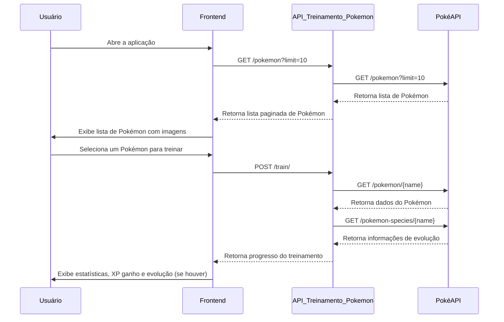

# 🏋️‍♂️ Train PokeLearning API - Treinamento Pokémon com Machine Learning!

🔥 **Bem-vindo ao futuro do treinamento Pokémon!** Agora os treinadores não apenas batalham, mas também **treinam seus Pokémon como verdadeiros cientistas de dados!**

A **Train PokeLearning API** foi criada para **simular um modelo de Machine Learning aplicado ao treinamento Pokémon**, onde cada batalha, estratégia e taxa de aprendizado impacta diretamente no XP adquirido e na possibilidade de evolução.

## 📌 **Sobre a API**

Esta API **não armazena dados** – ela consulta a **PokéAPI** em tempo real para fornecer estatísticas, imagens e informações sobre cada Pokémon.

🚀 **Objetivo:** Apoiar avaliações técnicas, fornecendo um backend pronto para consumo em um teste de desenvolvimento frontend.

📡 **URL Base:** [`https://treinamento.inteligenciadascoisas.com.br/`](https://treinamento.inteligenciadascoisas.com.br/)

📂 **Repositório:** [`github.com/alexandremendoncaalvaro/train-poke-learning-api`](https://github.com/alexandremendoncaalvaro/train-poke-learning-api)

---

## 🛠️ **Tecnologias Utilizadas**

- **Python** 🐍 + **FastAPI** 🚀
- **HTTPX** para chamadas externas à **PokéAPI**
- **Uvicorn** para execução da aplicação

---

## 🚀 **Como Rodar o Projeto**

### **Pré-requisitos**

- **Python 3.11+**

### **Rodando Localmente**

```bash
# Clone o repositório
git clone https://github.com/alexandremendoncaalvaro/train-poke-learning-api.git
cd train-poke-learning-api

# Crie um ambiente virtual
python -m venv venv
source venv/bin/activate  # No Windows: venv\Scripts\activate

# Instale as dependências
pip install -r requirements.txt

# Inicie a API
uvicorn main:app --reload --port 8000
```

📡 **Acesse a API em:** `http://127.0.0.1:8000`
📄 **Documentação Interativa:** `http://127.0.0.1:8000/docs`

---

## 🔗 **Rotas da API**

### **1️⃣ Listar Pokémon disponíveis**

📡 `GET /pokemon?limit=10&offset=0`

🔎 Retorna uma **lista paginada de Pokémon** com suas respectivas imagens.
📡 A API busca diretamente na PokéAPI.

**Exemplo de resposta:**

```json
{
  "count": 1302,
  "next": "https://treinamento.inteligenciadascoisas.com.br/pokemon?limit=10&offset=10",
  "previous": null,
  "pokemons": [
    {
      "name": "bulbasaur",
      "image_url": "https://raw.githubusercontent.com/PokeAPI/sprites/master/sprites/pokemon/1.png"
    },
    {
      "name": "charmander",
      "image_url": "https://raw.githubusercontent.com/PokeAPI/sprites/master/sprites/pokemon/4.png"
    }
  ]
}
```

---

### **2️⃣ Obter imagem de um Pokémon**

📡 `GET /pokemon/{name}/image`

🔎 Retorna a imagem do Pokémon em **Base64**, útil para exibição frontend sem carregar URLs externas.

**Exemplo de resposta:**

```json
{
  "pokemon": "pikachu",
  "image_base64": "/9j/4AAQSkZJRgABAQAAAQABAAD..."
}
```

---

### **3️⃣ Treinar um Pokémon**

📡 `POST /train/`

🏋️‍♂️ **Simula um treinamento Pokémon baseado em Machine Learning!**
Cada batalha gera **XP**, e se o Pokémon atingir um limite, **ele pode evoluir**.

**Parâmetros esperados:**

```json
{
  "pokemon": "pikachu",
  "epochs": 5,
  "batch_size": 3,
  "learning_rate": 0.5,
  "optimizer": "ofensivo",
  "early_stopping": false
}
```

**Exemplo de resposta:**

```json
{
  "pokemon": "pikachu",
  "final_pokemon": "raichu",
  "total_xp": 1500,
  "battles": [
    { "epoch": 1, "xp_gained": 300 },
    { "epoch": 2, "xp_gained": 250 }
  ],
  "optimizer": "ofensivo",
  "learning_rate": 0.5
}
```

💡 **Regras de evolução**:

- Cada Pokémon tem um **limite de XP** necessário para evoluir.
- A evolução ocorre **automaticamente** quando o XP necessário é atingido.

---

### **4️⃣ Health Check**

📡 `GET /health`

✅ **Verifica o funcionamento da API e a conexão com a PokéAPI**.

**Exemplo de resposta (API operacional):**

```json
{
  "status": "ok"
}
```

**Exemplo de resposta (PokéAPI fora do ar):**

```json
{
  "status": "unhealthy",
  "details": "Failed to reach PokéAPI"
}
```

---

## 🎮 **Fluxo de Funcionamento**



---

🚀 **Agora é com você!** Explore a API, treine seus Pokémon e veja quem se torna o verdadeiro mestre do **Pokémon Learning**! 🔥⚡
